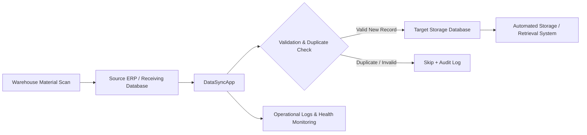

# DataSyncApp — Real-Time ERP ↔ Automated Storage Integration

**Enterprise Manufacturing Integration | C#/.NET | SQL Server | Windows Desktop**

DataSyncApp is a production-oriented synchronization application designed to bridge a manufacturing ERP receiving workflow with an automated material storage system.

The application continuously detects newly received material records, prevents duplicate transfers, synchronizes valid records to the downstream storage system, and provides operators with clear health monitoring and audit logs.

> **Public portfolio note:** This repository is a sanitized technical case study. Employer-specific source code, credentials, production connection details, proprietary database objects, and confidential operational data are intentionally excluded.

## Business Problem

Warehouse operators record material receipts in the source ERP environment. The automated storage system must receive the corresponding information promptly so that warehouse storage and retrieval operations reflect current material receipts.

A manual re-entry process creates several risks:

- delayed downstream updates;
- duplicate or missing entries;
- human data-entry errors;
- limited auditability;
- poor scalability as transaction volume increases.

## Solution

I designed and implemented a Windows-based synchronization application that acts as the integration layer between the two systems.

### Core capabilities

- Near-real-time incremental synchronization
- Duplicate prevention using existing transaction identifiers
- Database-to-database transfer through parameterized SQL
- Controlled start/stop operation
- Continuous health/status monitoring
- Error and warning logging
- Transfer-history visibility
- Operator-friendly desktop interface
- Graceful cancellation and restart behavior
- Extensible architecture for future Windows Service deployment

## High-Level Architecture



## Technical Design

The solution separates responsibilities into independent application layers:

- **Source Service** — reads newly available receiving records from the source system.
- **Target Service** — checks existing target records and inserts valid new records.
- **Synchronization Service** — orchestrates incremental synchronization and cancellation.
- **Windows UI** — provides start/stop controls, live status, counters, and logs.
- **Logging/Audit Layer** — records activity and failures for troubleshooting and traceability.

See [Architecture](docs/ARCHITECTURE.md) for more detail.

## Synchronization Flow

1. Read transaction identifiers already present in the downstream storage system.
2. Query candidate receiving records from the source ERP.
3. Exclude already-synchronized transactions.
4. Transfer only new records.
5. Record success, warnings, and failures in operational logs.
6. Wait briefly and repeat the synchronization cycle.
7. Allow operators to stop the process gracefully when needed.

## Reliability Features

The production design includes:

- parameterized SQL commands;
- duplicate-transfer protection;
- exception handling around synchronization cycles;
- cancellation tokens for graceful stopping;
- configurable database connectivity;
- continuous status feedback;
- persistent daily logs;
- restart-safe incremental processing.

## Operational Value

DataSyncApp replaces a manual integration step with an automated and auditable workflow.

The solution supports daily warehouse operations by keeping downstream material information synchronized with current receiving activity. If the synchronization layer is unavailable, the business must intervene operationally to keep systems aligned.

Exact production volumes and employer-specific impact figures are maintained privately and are not published in this repository.

## Technology Stack

- C#
- .NET
- Windows Forms
- Microsoft SQL Server
- ADO.NET / Microsoft.Data.SqlClient
- Microsoft.Extensions.Configuration
- Async programming / Task-based processing
- CancellationToken
- File-based operational logging

## Repository Contents

```text
DataSyncApp_GitHub_Showcase/
├── README.md
├── SECURITY.md
├── .gitignore
├── docs/
│   ├── ARCHITECTURE.md
│   ├── CASE_STUDY.md
│   ├── OPERATIONS.md
│   └── GITHUB_UPLOAD_STEPS.md
└── src-sample/
    └── SyncEngineSample.cs
```

## What Is Intentionally Not Included

This public repository does **not** contain:

- production source code;
- employer credentials or connection strings;
- internal server names;
- proprietary table or schema names;
- production screenshots containing confidential information;
- customer or material data;
- complete production logs;
- proprietary business rules.

## My Role

I designed and implemented the synchronization application, including the integration workflow, duplicate-detection logic, database transfer behavior, background synchronization loop, operational status interface, and logging/monitoring features.

## Documentation

- [Architecture](docs/ARCHITECTURE.md)
- [Technical Case Study](docs/CASE_STUDY.md)
- [Operations & Reliability](docs/OPERATIONS.md)

---

**Portfolio classification:** Enterprise Software Engineering / Manufacturing Systems Integration / Industrial Automation
