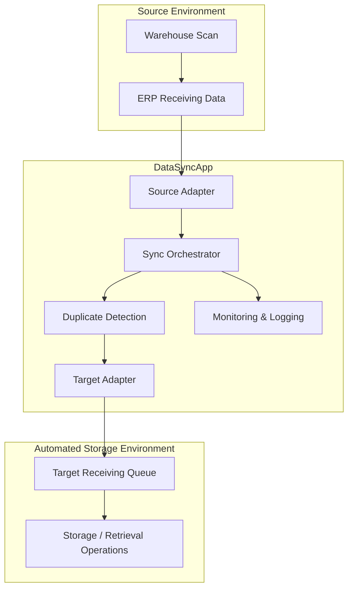

# Architecture

## 1. System Context

DataSyncApp is an integration layer between a source manufacturing ERP receiving workflow and a downstream automated material storage system.

The system is designed to keep downstream material-receipt information synchronized without requiring operators to manually re-key every receiving transaction.

## 2. Logical Architecture

## 3. Component Responsibilities

### Source Adapter
Retrieves candidate receiving transactions from the source environment.

Responsibilities:
- open the configured source database connection;
- read candidate transactions;
- map database values into application records;
- return records to the synchronization layer.

### Target Adapter
Provides access to downstream storage records.

Responsibilities:
- retrieve identifiers already present in the target system;
- insert new valid records;
- use parameterized commands for writes.

### Synchronization Orchestrator
Coordinates a single synchronization cycle and continuous execution.

Responsibilities:
- obtain existing target identifiers;
- request new source records;
- transfer only records not already synchronized;
- count successful transfers;
- handle cancellation;
- repeat the cycle at a short interval;
- surface exceptions to the operational log.

### User Interface
Provides a simple operational control surface.

Responsibilities:
- start synchronization;
- stop synchronization;
- display current health state;
- display total records synchronized;
- display most recent activity;
- open historical logs.

### Logging Layer
Provides operational traceability.

Responsibilities:
- timestamp informational, warning, and error events;
- store daily log files;
- support troubleshooting and audit review.

## 4. Reliability Principles

### Incremental processing
The application does not blindly re-send every source record. It compares candidate identifiers with the downstream system and transfers only new records.

### Idempotency / duplicate protection
Already-synchronized identifiers are skipped, reducing the risk of duplicate receiving records.

### Graceful shutdown
Cancellation tokens allow operators to stop synchronization without abruptly terminating the process.

### Fault visibility
Exceptions are surfaced through operational logs rather than failing silently.

### Restartability
Because records are checked against the target system before insertion, the synchronization process can resume after an interruption and continue with pending records.

## 5. Security and Confidentiality

Production connection strings, server names, credentials, proprietary database schemas, and employer-specific infrastructure are intentionally excluded from this public portfolio repository.

## 6. Future Architecture

A logical next evolution is hosting the synchronization engine as a Windows Service while retaining an administrative monitoring interface. This would reduce dependence on an interactive desktop session while preserving operational visibility.
